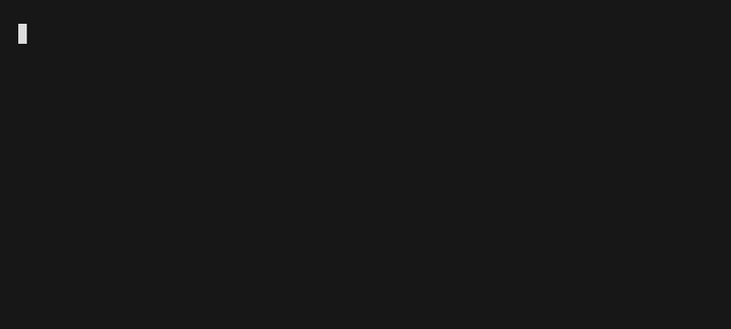

<h1>⏳ trackie</h1>

`trackie` is a private, daemon-less time tracker running in your CLI.

---

Trackie offers an easy CLI to track the time you spent on your various projects. It bundles up your busy days in easy digestible reports that you can filter to your liking.

All data is saved to `~/.config/trackie.json` where it can be processed by other tools.

Trackie is optimized to lower its complexity to the absolute minimum.

---

## Usage

Trackie currently consists of three simple commands:

- `trackie start <project-ID>`: Starts time tracking for a project with the given ID.
- `trackie stop`: Stops the time tracking
- `trackie report [-d <num-days] [-i/--include-empty-days]`: Creates a report for the last *n* days (default: 5).

## Installation

#### Download prebuilt release

1. Download the binary for your respective OS from [the latest release](https://github.com/beatbrot/trackie/releases).
2. Copy it to a folder in your `PATH`.

#### Compile from source

1. Run `cargo install trackie`.
